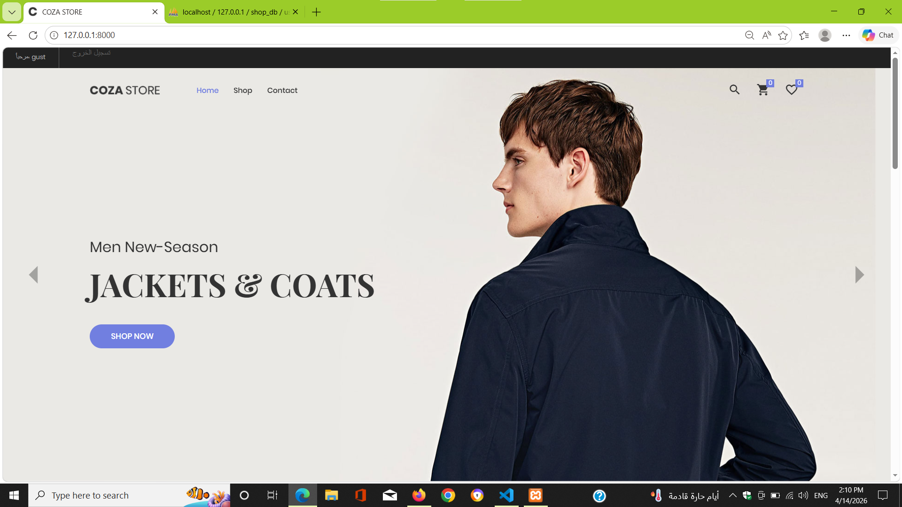
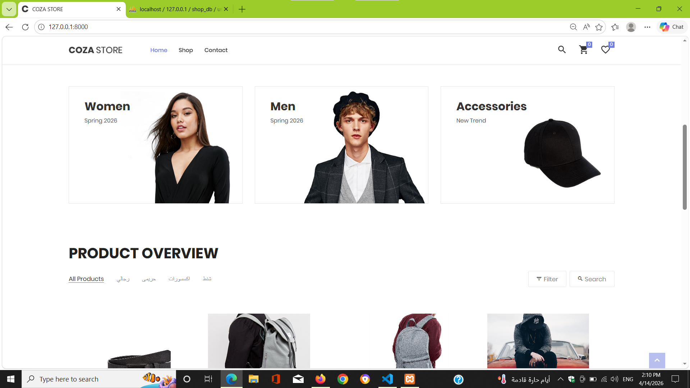
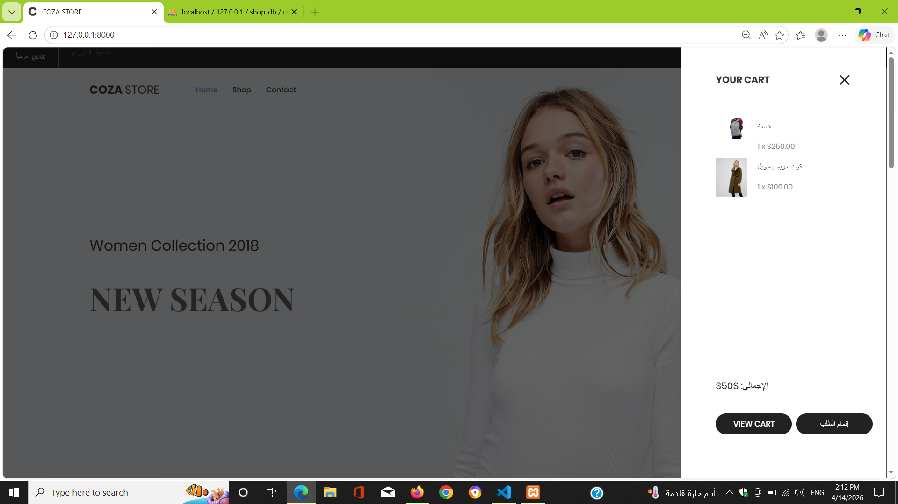

# 🛒 Laravel E-Commerce System

## 📌 Description
This is a full e-commerce web application built with Laravel.  
It includes an admin panel for managing products and categories, and a user system for browsing and purchasing products.

---

## 🚀 Features

### 👤 User Side
- User Registration & Login
- Browse Products
- Product Details Page
- Add to Cart
- Shopping Cart System

### 🛠 Admin Panel
- Add / Edit / Delete Products
- Manage Categories
- Dashboard for managing store

---

## 🖼 Screenshots

### 🏠 Home Page


### 📦 Product Details


### 🛒 Cart


### ⚙️ Admin Panel


---

## 🛠 Technologies Used
- Laravel
- PHP
- MySQL
- Blade
- Bootstrap

---

## ⚙️ Installation

```bash
git clone https://github.com/mahmoudtawfik1998/laravel-ecommerce.git
cd laravel-ecommerce
composer install
cp .env.example .env
php artisan key:generate
php artisan migrate
php artisan serve

Email: admin@admin.com
Password: 12345678

📌 Notes
Make sure to configure your database in .env
Run migrations before starting the project
👨‍💻 Developer

Mahmoud Tawfik
Laravel Backend Developer
